## July 3: Planning + Design Sketches

#### What I want:
- 75% ish - I've had bigger keyboards and currently have a 100% keyboard and don't find myself ever using the number pad, so I want to create a smaller keyboard
- Not tons of wasted space from microcontrollers and a screen
- I would prefer to have a few macro keys but if I can't fit them in very well i'll just use the macropad I created
- Knob for changing volume and playing/pausing music - I had a keyboard with a volume knob and absolutely loved it!
- Screen for showing volume and current song listening to
- Backlight but I might make the case out of acrylic, in that case I won't use back lights

#### Design 1

**What I like:**
- Not alot of wasted space
- Knob and screen

**What I dont like:**
- No macro keys

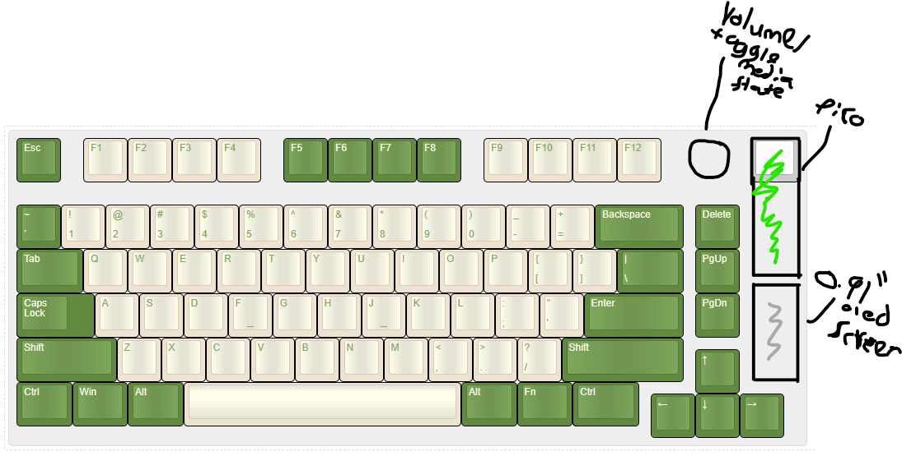

#### Design 2

**What I like:**
- No wasted space
- Plenty of macro keys

**What I dont like:**
- Pico placement - usb cable would get in the way of my mouse
- Too compact (i'd probably accidentally hit the wrong key a few too many times)
- Knob placement - I want it at the top
- No Screen

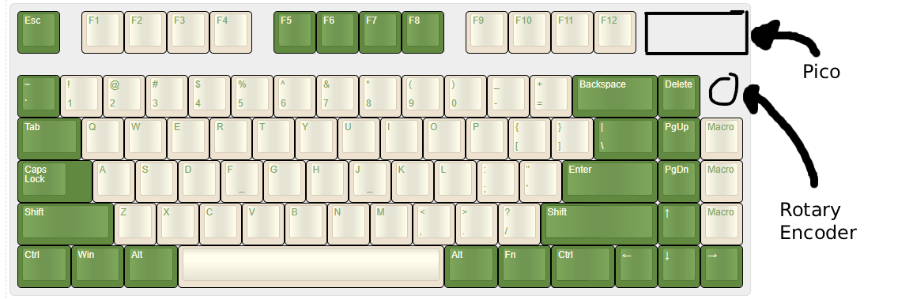

#### Design 3

**What I like:**
- Pico placement
- Screen
- Knob placement
- Plently of macro keys

**What I dont like:**
- A bit of wasted space at the top
- Too compact

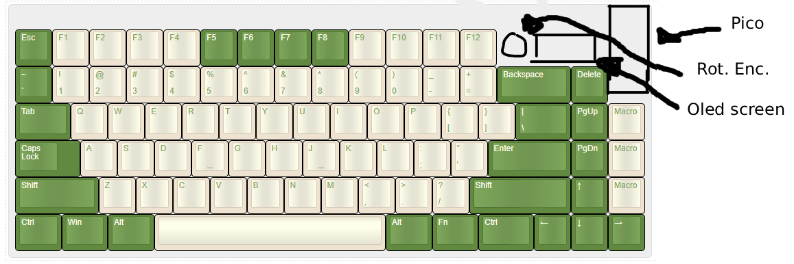

#### Final Design

**What I like:**
- Pico placement - cord won't get in the way of my mouse
- Knob placement - easy to reach quickly and adjust volume
- Screen - Can glance at the screen and see the song i'm listening to
- Very little wasted space (excluding space used to space the keys out more)

**What I dont like**
- Only 1 macro key

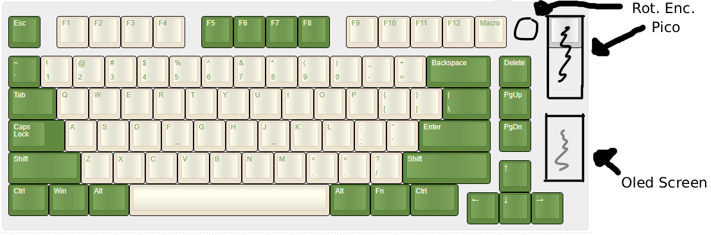

**Total time spent: 1.25 hours**

## July 3 + 4: Making the Schematic

I have used kicad before so I know the basics of how to navigate it but struggled to get the mrbastlib symbols to show for a little even though I had the library installed.
My current design of a 15 * 6 matrix with the rotary encoder and screen doesnt leave many gpio pins available for extra features if I want to add them.
If I decide I want to include led's or another feature i will have to change the layout of my matrix
I want my keyboard to be top mounted, so I didnt add any mounting holes as they wont be needed

#### What I found difficult:
- Getting the marbastlib to work (thanks Neeraj Rajesh on Slack for helping!)
- Wiring the screen (didnt know what SCL and SDA were)

#### What I found easy:
- Placing components
- Wiring the matrix (I've made a macropad with a matrix before)

#### What I learned:
- How to wire a 4 pin oled (GND, VCC, SCL, SDA)
- How to install a library inside of kicad

#### Matrix Wiring
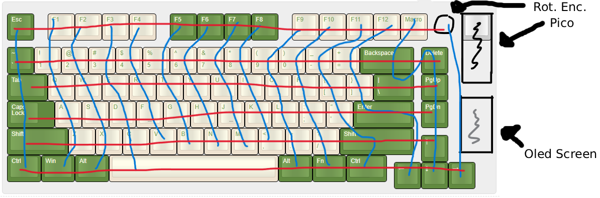

#### Schematic
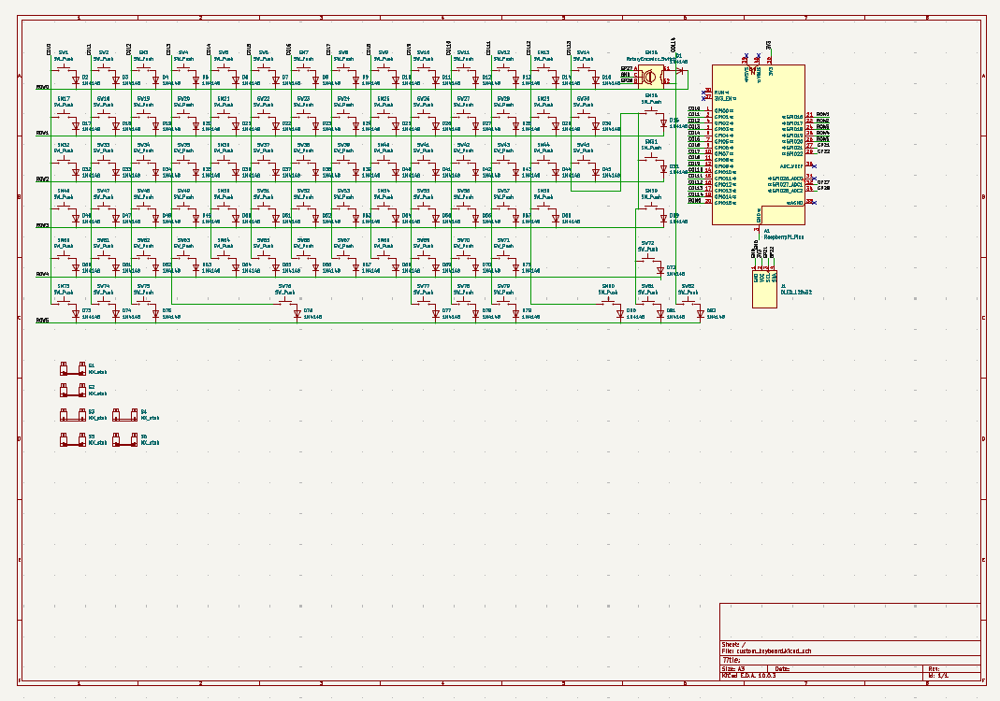

**Total time spent: 1.9 hours**

## July 4 + July 5 + July 6: Making the PCB

Everything except adding 3d models was done on 04/07/2026.

Now it's time for the fun part!
I like placing components and designing PCB's because it feels like lego and feels very satisfying when you can finally see your vision in some way or another.

### Making the Rough Key Layout
I started with the rough key layout where I palced the keys roughly where I wanted them and without stabilizers or different key sizes, all 1u.
I did this so that I could get an idea of what I wanted better.
I spent about 0.53 hours on this.

**Rough Switch Placement**
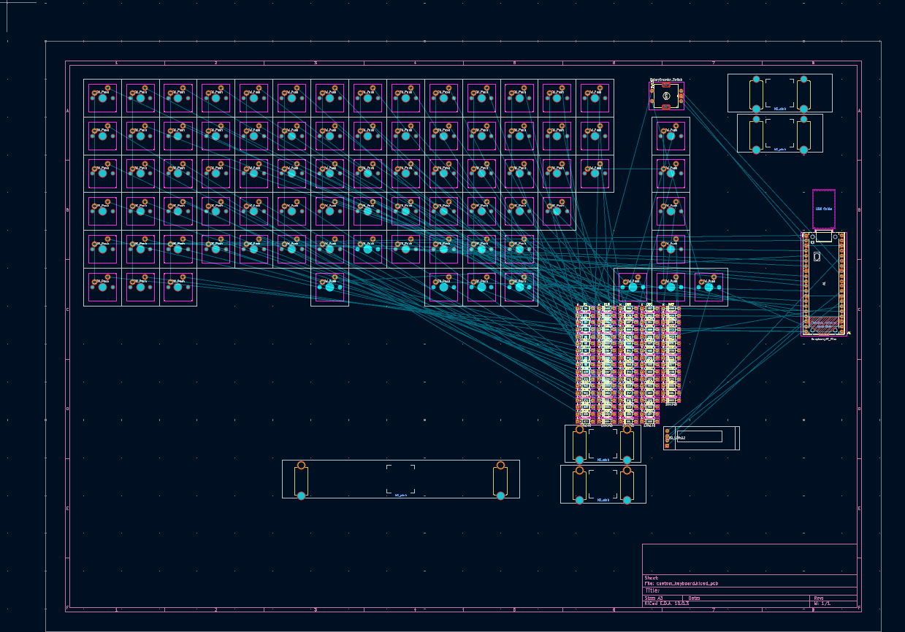

### Key placement and Stabilizers
After I finished with the rough layout I added the stabilizers and different key sizes, during this I almost made a slight change to my design.
I moved the function keys over by 0.25u and made the macro key .25u bigger, changing its size from 1u to 1.25u.
I made these changes so that I could center the rotary encoder with the Insert, Delete and End key.
All of this took me 1.2 hours.

**Key Placement**
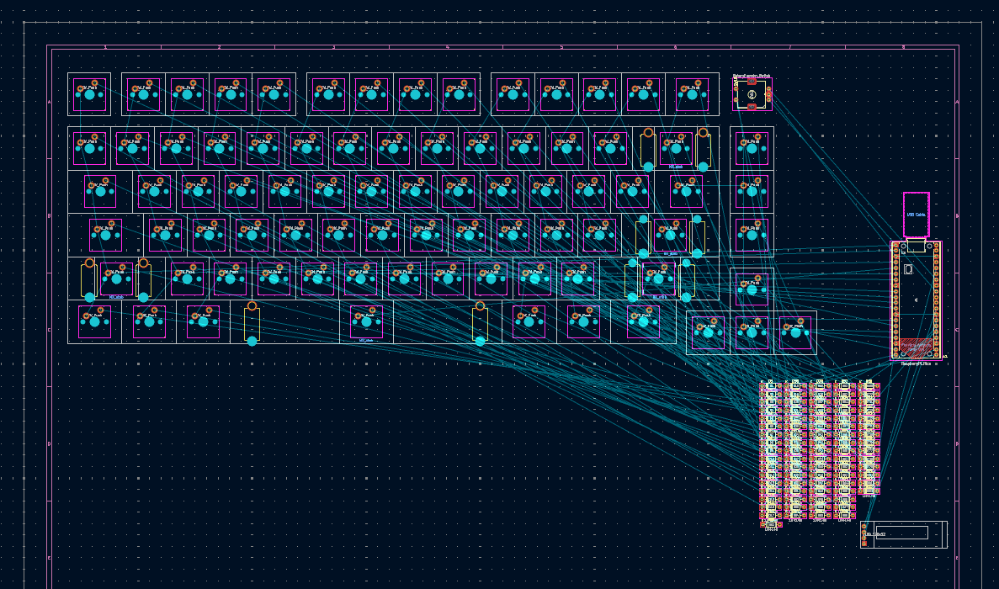

**Changed Layout Sketch**
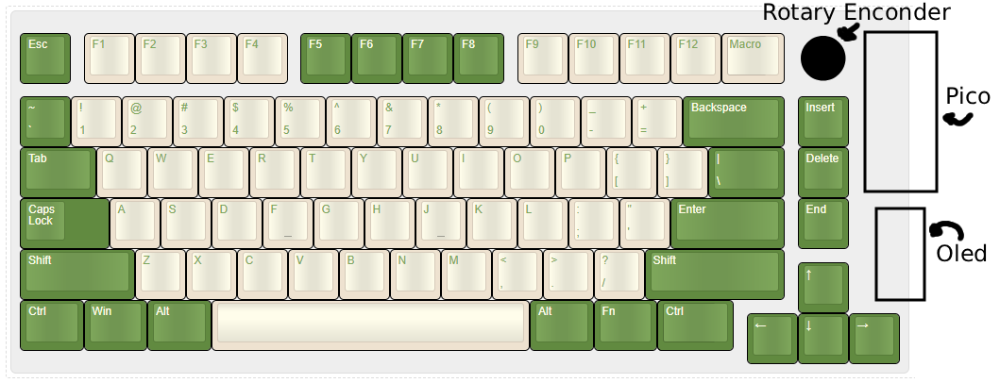

### Placing the Remaining Components
After I finished with the key placing I placed the remaining components:
- Pico
- Diodes
- Screen

This process took me 0.47 hours.
The most time consuming part was placing the diodes.

**PCB After Components Placed**
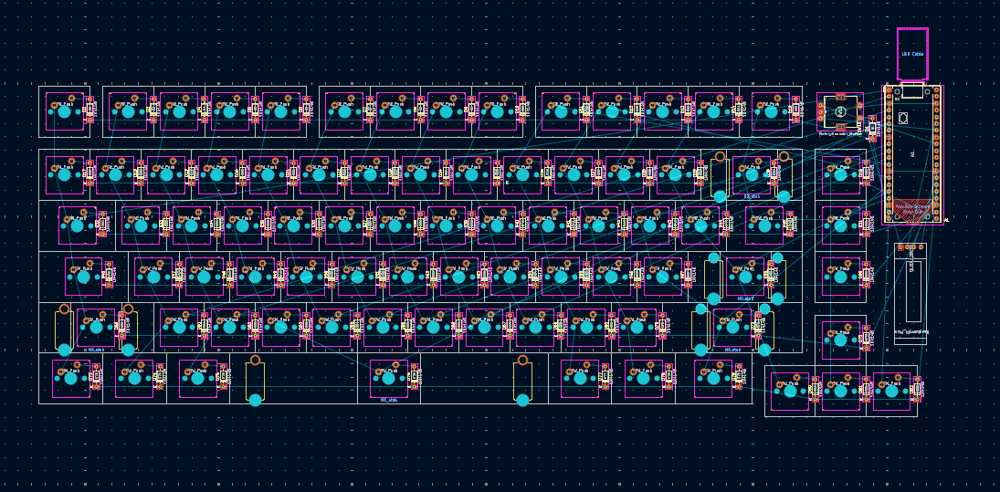

### Wiring Traces
The final step to making my PCB is wiring the traces
I found wiring the traces pretty relaxing especially while listening to music
I also added the edge cut and rounded the edges
I made the silkscreen white and the PCB black
Aswell as those I added a filled zone to isolate the traces from the rest of the copper, it makes the trace more visible aswell.
I spent 1.1 hours doing this

**PCB Without Filled Zones**
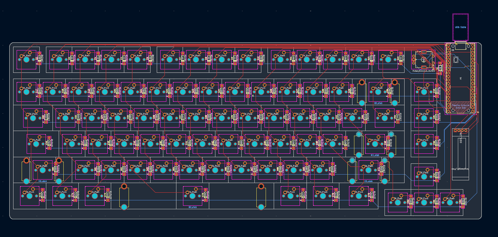

**PCB With Filled Zone**
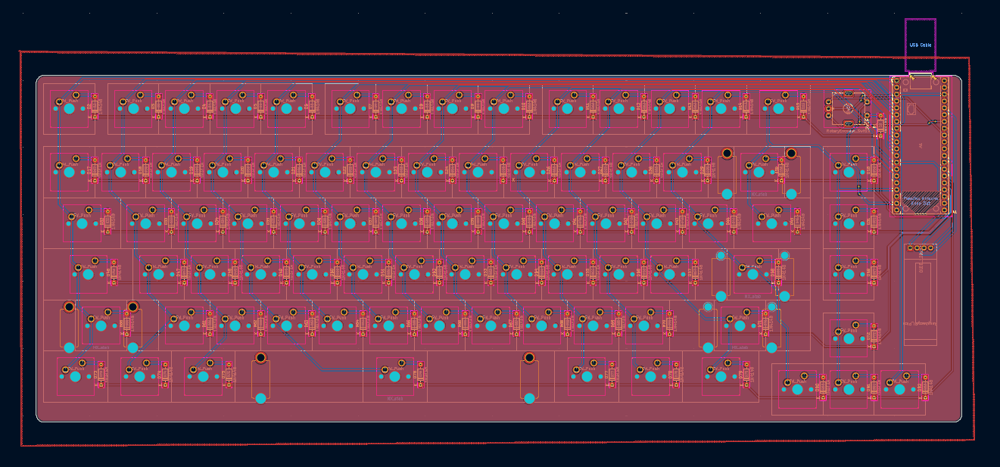

**PCB Front View**

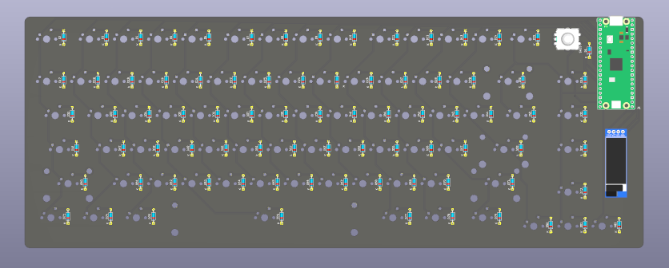

**PCB Back View**

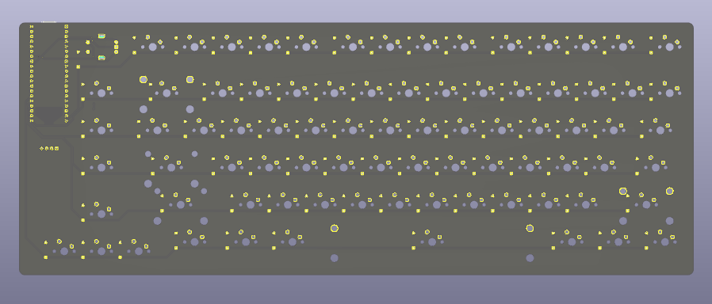

### Adding 3D Models (05/07/2026 + 06/07/2026)

*Time Spent: 1.3 hours*

#### My struggles:
- Getting the 3d model in the right position
- Finding 3d models

**PCB With Switch and Stabilizer 3D Models**

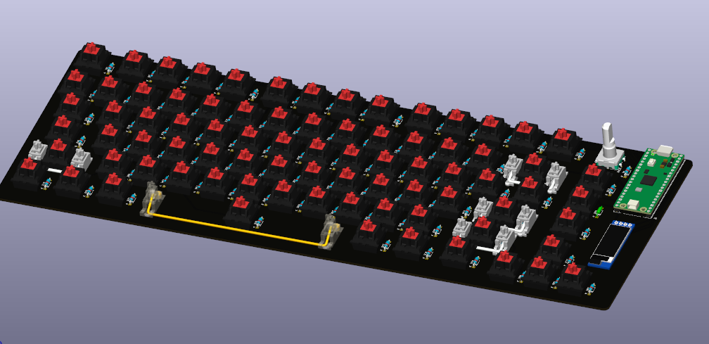

#### asset links:
2u stabilzer https://grabcad.com/library/cherry-mx-stabilizer-mx-1 \
6.25u stabilzer https://github.com/kiswitch/kiswitch/blob/main/library/3dmodels/3d-library.3dshapes/Stabilizer_Cherry_MX_6.25u.stp \
switch https://github.com/ConstantinoSchillebeeckx/cherry-mx-switch

### Running DRC + Fixing Warnings (06/07/2026)

*Time Spent: 0.15 hours*

I encounterd 5 warnings and 0 errors:
- Track has unconnected end
- Isolated copper fill (2x)
- Silkscreen clipped by board edge (2x)

To fix the track has unconnected end warning I rerouted the part of the trace that wasnt connected
The other warnings I clicked ignore on as I deemed they were not important and would not affect the board in any negative way other than a tiny part of the pico silkscreen being cut off but it was not important

**DRC Before Fixing**

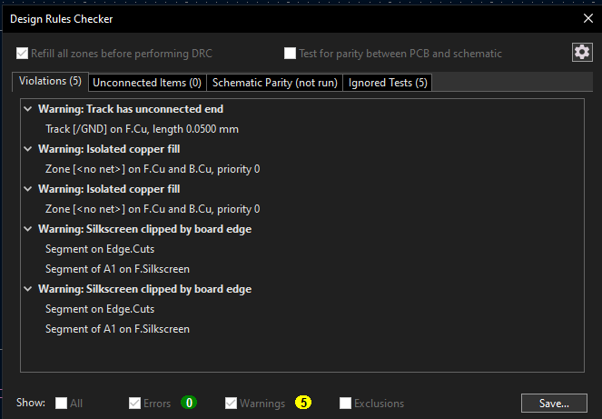

**DRC After Fixing**

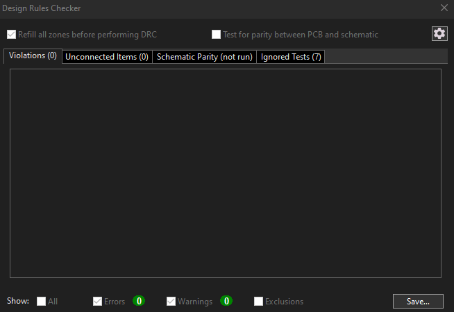

**Total time spent: 4.75 hours**

## July 7: Designing the Silk Screen

Added some pictures and text to the front and back silk screen and outline to board
Tutorial Used: https://www.youtube.com/watch?v=JVZk_96jJsI

**Front Silkscreen**
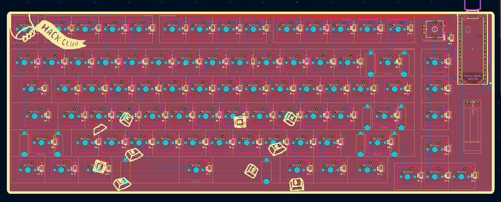

**Front Silkscreen 3D**
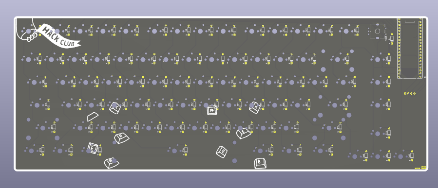

**Total time spent: 0.58 hours**

## July 7 + July 8: Making Changes

I decided I didn't want the screen and replaced it with 2 extra macro keys
I also added SK6812MINI-E LEDS and M3 mounting holes

I started by making the changes to the schematic, I deleted the screen then added the led and wired them, I used [the data sheet](https://www.lcsc.com/datasheet/C5149201.pdf?spm=wm.sxq.inf.ggs&lcsc_vid=E1ZbBFRfEVcLVgFWFVIPAgcERQRXAVVQFVNdX1VeRlAxVlNeRFVWUFVTQllZXzsOAxUeFF5JWAoLAgZIHwANDAcKAgNABAsLWA%3D%3D) to figure out what goes where.
I struggled with keeping the schematic organized

**LED Array Schematic**

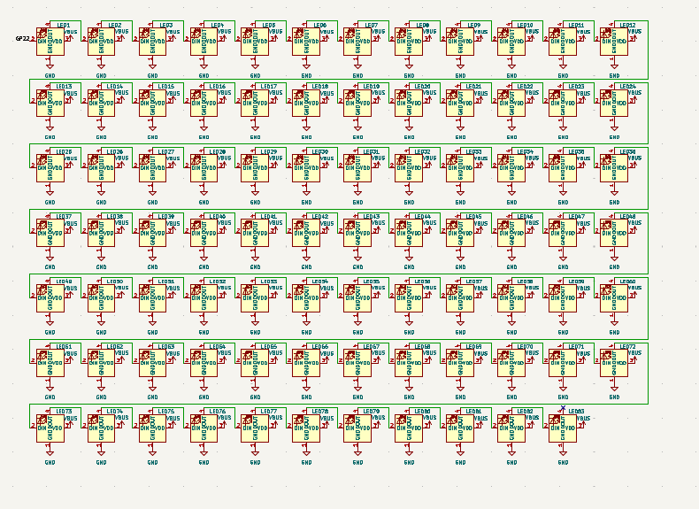  

After I finished with the schematic I updated the PCB and started placing the LEDS aligned to the center and at the bottom of each switch, this process was very tedious and time consuming.

**LED's and Extra Macros Placed**
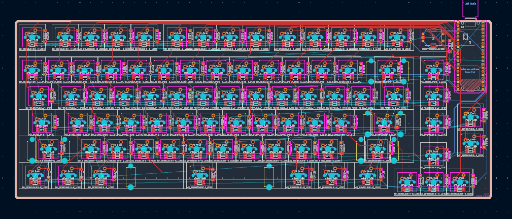

Once I placed the LEDS I realized I was going to need to reroute all the traces on the Front Copper Layer in order to have them wired neatly.

**Front Copper Traces Removed**
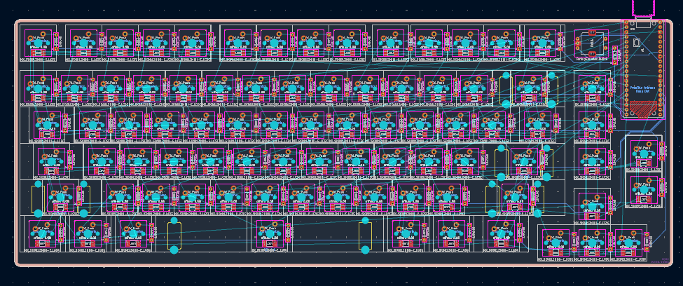

After I removed the Front Copper Layer traces I started wiring the DIN and DOUT pads of the leds, after that I wired the VDD to the VBUS of the pico.
I found wiring the Power particulary challenging as the traces have to be much bigger than the other ones so I had to make space.
I then re routed the coloumns

**Traces Routed**
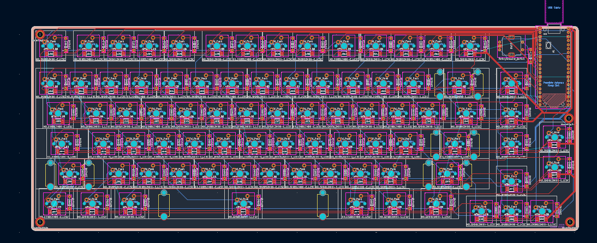

**New Layout**
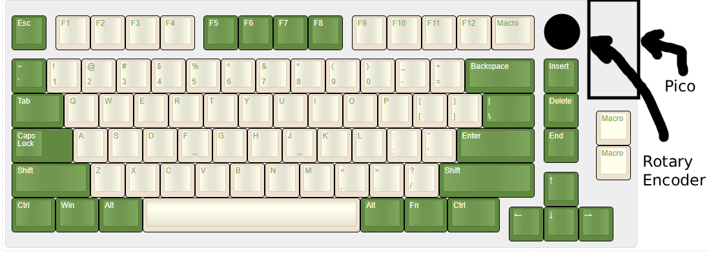

**Total time spent: 2.7 hours**

## July 8 + July 9: Running DRC + Fixing Errors and Warnings

After I finished routing all the led's and colunms I ran the DRC
Lets just say, the results of the DRC are not what I wanted or expected, I expected some errors because i've never routed led matrix's but i though only a few, not **384** and **105** warnings 😬

**Not Good**

The most prominent error was: Board edge clearance violation

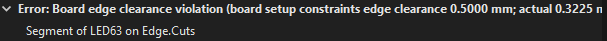

A majority of these came from the led's pads being too close to the edge cut of the led
to fix this I moved the pads slightly over and decreased the board edge clearance restraint in *File/Board Setup/Design Rules/Constraints*. The amount I changed it to is still well within the manufacture I plan to use (JLCPCB) abilities.
Although a lot of the Board Edge Clearance Violations came from the pads being to close to the edge cuts quite a few also came from the row traces being to close to the LED edge cuts, I fixed those by moving the trace up slightly.

The second large amount of errors I encountered were from the courtyards of thew switches and LED's overlapping.
I looked at the sizes of the components in the 3d viewer and data sheet and concluded that the courtyards overlapping would not be a problem so I simply ignored those errors.

I also moved the silk screen borders to avoid touching the mounting holes (had a warning for that)

I have alot of warnings still for silk screen clearance (silk screen touching other silkscreen or over an edge cut)
I believe when I export the Gerbers I can make it clip those automatically, if not I will fix them.

I also realized I forgot to wire the grounds of the LED's
I created a ground plane to wire them easily

**Finished PCB**
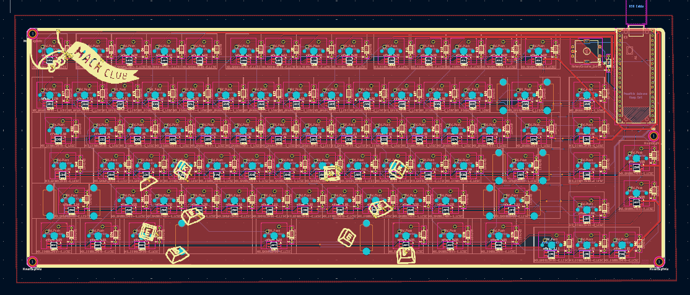

**Finished PCB 3D**
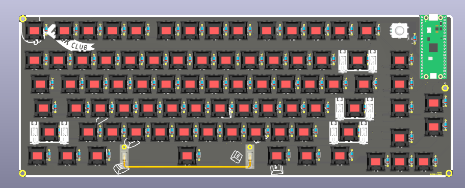

**Total time spent: 1.75 hours**

## July 24 + August 8: Making the Case

The case took me way longer than I would've wished because it was my first time using onshape and I struggled a lot doing the most basic of things. 
The progress is spread over many days doing a tiny bit of work each day.

#### What I found difficult:
- Learning how to navigate onshape
- Learning the different tools and features of onshape
- Fixing import errors
- Extruding with remove

#### What I found easy:
- Downloading the pcb model from kicad 😭

#### What I learned:
- How to make a sketch in onshape
- How to extrude in onshape (and different extruding ways)
- How to make a chamfer

### Importing the PCB 3d model and making the base
I started by importing the PCB 3d model and making the base of the case
When importing the PCB model I encountered problems with it not loading correctly

**Case Base**
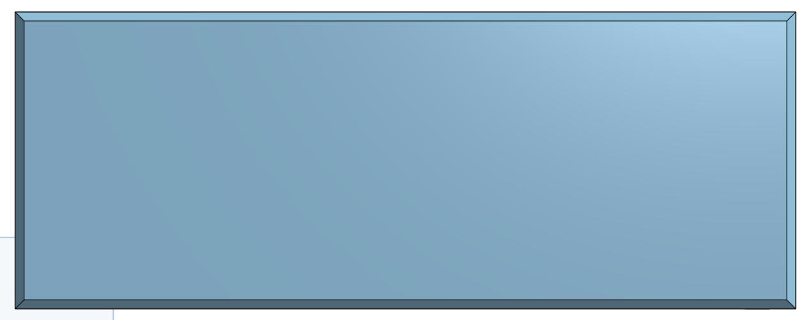

### Adding walls and making the plate
I then added walls and made the plate that the keys go on.
I found it time consuming to place the key holes even with the linear pattern tool. (more screenshots of creating the plate and tools used in Images/Case)

**Case Walls**
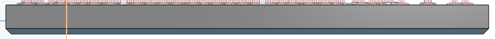
**Case Plate**
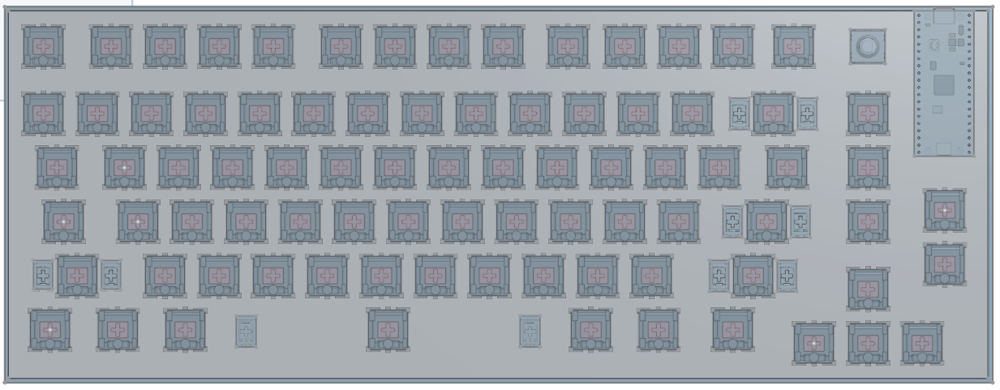

### USB port
After I made the walls and plate I cut a hole in the wall so you can access the usb port on the raspberry pi pico.

**USB Port Cutout**

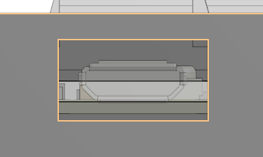

### Splitting and making alignment pillars
After all of that I split the case into 2 segments and added alignment pillars so I can connect them together easily once 3d printed

**Split and alignment**
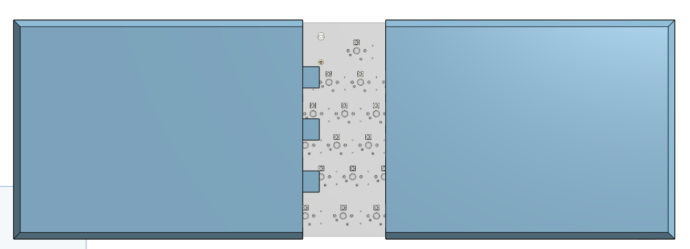

I may make minor changes to the case after submitting

**Total time spent: 3.23 hours**

## August 8 + August 10 + August 12: Fixing the PCB

I started by looking at the datasheet and noticed my pin locations on the footprint where wrong and on the wrong copper layer for reverse mount (placed on bottom copper layer with hole in pcb that allows light to shine to the key)

**Old Footprint**

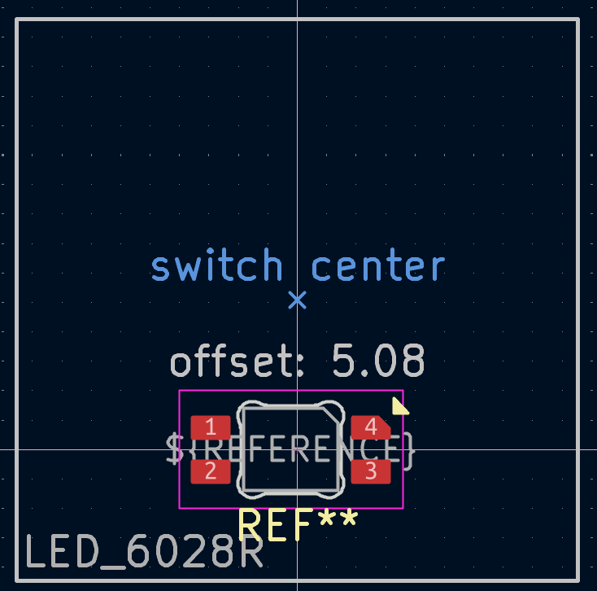

**Updated Footprint**

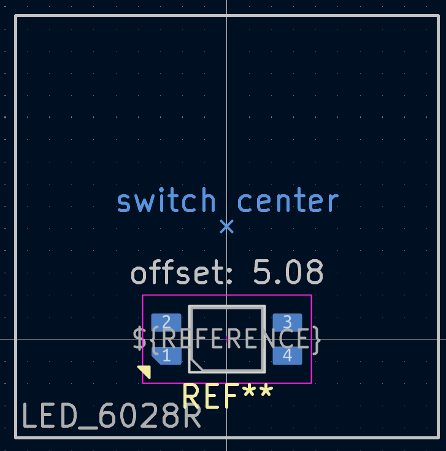

After I fixed the footprint I got started on adding the capacitors and resistors to the schematic

**Fixed LED Matrix Schematic**

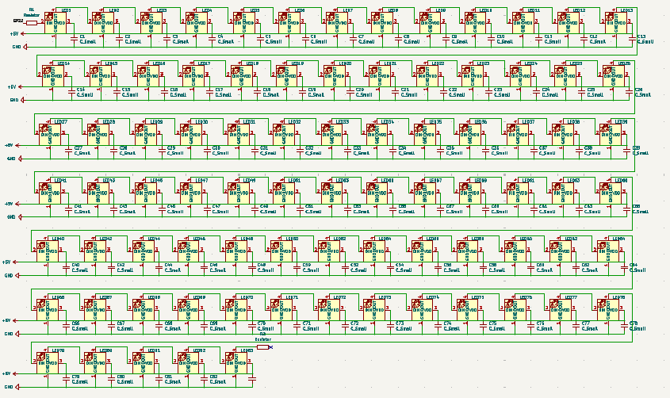

After doing the schematic I moved onto the PCB, I started by removing the old LED's and traces for them and then adding the new LED's along with a capacitor for each one, I then placed the resistors at the first and last data pin of the led matrix. The next step I took was cleaning up and moving some of the column traces as they would get in the way of the LED power and data traces and it would be much easier to move those than trying to work around them with the LED traces in an already crowded area. I then wired the VBUS to one side of each capacitor and to the VDD pad of each LED as well (Decoupling capacitors). I then did the data traces. After doing all those traces I decided to add a GND plane to the back copper layer as well, not just the front. I did this because The LED's on each LED required 2 GNDS (including capacitor and GND pad) and it would be way easier to connect them that way. I already had a front copper layer so via stitching was easy. I also cleaned up the silk screen a bit.

**Fixed PCB**

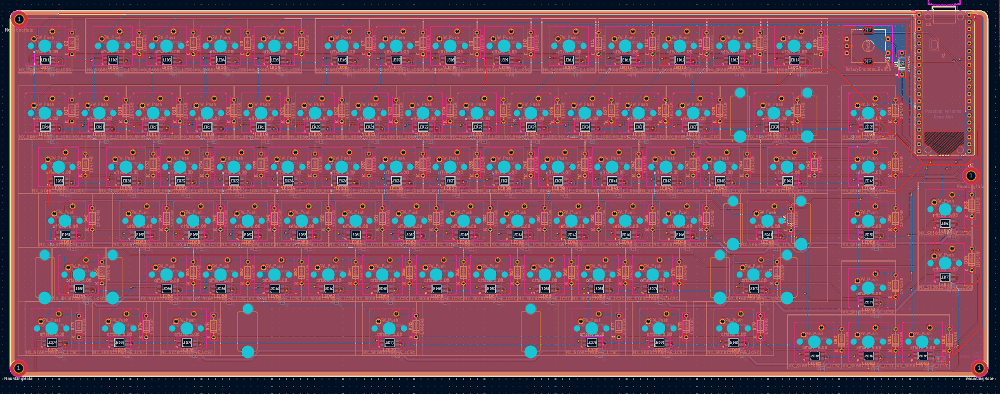

**Total time spent: 3.82 hours**

## August 13: Writing the Firmware

I decided to use KMK instead of RMK as I am more familiar with Python and found more tutorials available for KMK.
To make the firmware I watched [this playlist/tutorial by Tiny Boat Productions](https://youtube.com/playlist?list=PLtl-yze0Zzkm5n2ajJRUL48EyCyUgsXf6&si=secS5v1txR7g7JIm) on YouTube and used the [KMK docs on github](https://github.com/KMKfw/kmk_firmware/tree/main/docs/en)

I started off by defining the rows and columns then creating the keymap according to [my layout](../Images/Design_Sketches/Final_Final_Layout.png)
I Then added a save, calculator, and screenshot macro.
After I made the macros I Added the RGB LED's and a seperate layer for keys to change aspects about the LED's.
I set the max brightness of the LED's to 60 (max 255) and default to 40 to protect from power surges, I will increase/decrease once the keyboard is built and I can test them out.
I then added the rotary encoder and made it change the volume

**It is important to note you must have [circuitPy](https://circuitpython.org/) and [KMK](https://github.com/KMKfw/kmk_firmware) installed onto the pico for the code to work.**\
Macro snippet\

**Total time spent: 0.79 hours**

## August 13 + August 14 + August 15: Making the BOM

This includes researching parts, generating quotes, and making the Bill of Materials

I struggled trying to find good places for components that were affordable and had good shipping. Often I would find a part thats cheap but then the shipping would be insanely high, so I tried to find a balance of good price and good shipping.
Which led me to using amazon for quite a few parts because I have amazon prime.
I also found out that If you download the JLClone desktop app (JLCPCB desktop app) that you can get pcb manufacturing and shipping for substantially cheaper.

**Total time spent: 1.4 hours**

## August 15: Writing the README
I took some time to look at other peoples README's for inspiration and to write my own including what I learnt, features, why I built it, and more.\

**Total time spent: 0.63 hours**

## October 4: Transferred to Forge

I transferred the project to Forge as I submitted for review on KEEB almost 2 months ago and didn't hear anything back and the program has now ended.
I had to merge all my separate journals into one JOURNAL.md file.
Cleaned up the repo, updated the README with more images, added the BOM and fixed some typos I saw.
Added the PCB file to the PCB folder, I forgot to before.

**Total time spent: 1 hour**
