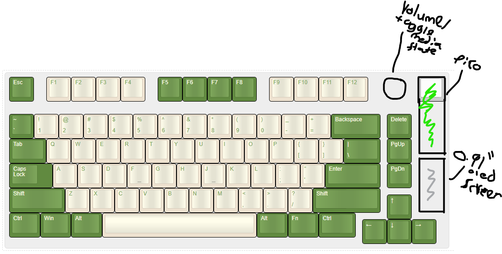
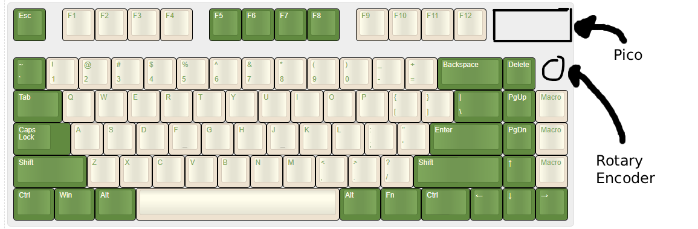
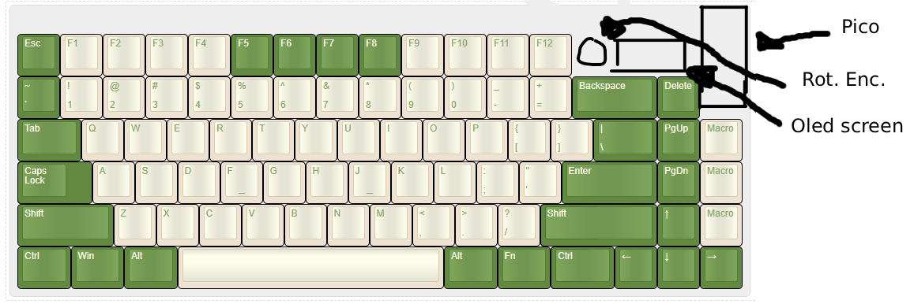
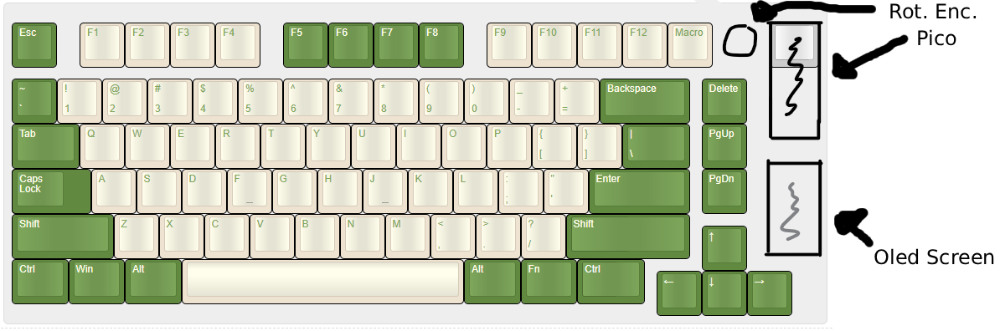

## 03/07/2026 - Planning and making design sketches

*Time spent: 1.25 hours*

#### What I want:
- 75% ish - I've had bigger keyboards and currently have a 100% keyboard and don't find myself ever using the number pad, so I want to create a smaller keyboard
- Not tons of wasted space from microcontrollers and a screen
- I would prefer to have a few macro keys but if I can't fit them in very well i'll just use the macropad I created
- Knob for changing volume and playing/pausing music - I had a keyboard with a volume knob and absolutely loved it!
- Screen for showing volume and current song listening to
- Backlight but I might make the case out of acrylic, in that case I won't use back lights

#### Design 1

**What I like:**
- Not alot of wasted space
- Knob and screen

**What I dont like:**
- No macro keys

#### Design 2

**What I like:**
- No wasted space
- Plenty of macro keys

**What I dont like:**
- Pico placement - usb cable would get in the way of my mouse
- Too compact (i'd probably accidentally hit the wrong key a few too many times)
- Knob placement - I want it at the top
- No Screen

#### Design 3

**What I like:**
- Pico placement
- Screen
- Knob placement
- Plently of macro keys

**What I dont like:**
- A bit of wasted space at the top
- Too compact

#### Final Design

**What I like:**
- Pico placement - cord won't get in the way of my mouse
- Knob placement - easy to reach quickly and adjust volume
- Screen - Can glance at the screen and see the song i'm listening to
- Very little wasted space (excluding space used to space the keys out more)

**What I dont like**
- Only 1 macro key

