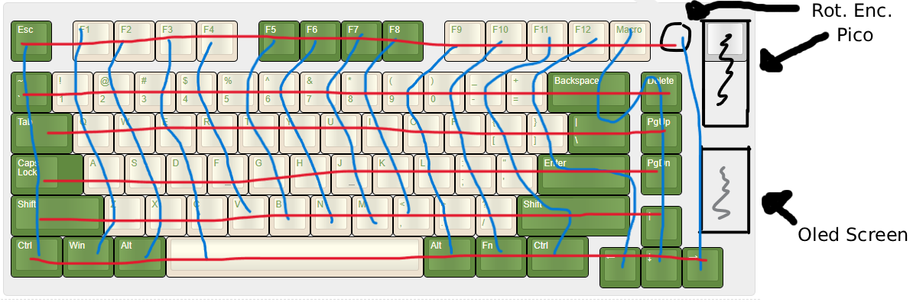

## 03/07/2026 + 04/07/2026 - Making the Schematic

*Time spent: 1.9 hours*

I have used kicad before so I know the basics of how to navigate it but struggled to get the mrbastlib symbols to show for a little even though I had the library installed.
My current design of a 15 * 6 matrix with the rotary encoder and screen doesnt leave many gpio pins available for extra features if I want to add them.
If I decide I want to include led's or another feature i will have to change the layout of my matrix
I want my keyboard to be top mounted, so I didnt add any mounting holes as they wont be needed

#### What I found difficult:
- Getting the marbastlib to work (thanks Neeraj Rajesh on Slack for helping!)
- Wiring the screen (didnt know what SCL and SDA were)

#### What I found easy:
- Placing components
- Wiring the matrix (I've made a macropad with a matrix before)

#### What I learned:
- How to wire a 4 pin oled (GND, VCC, SCL, SDA)
- How to install a library inside of kicad

#### Matrix Wiring

#### Schematic

