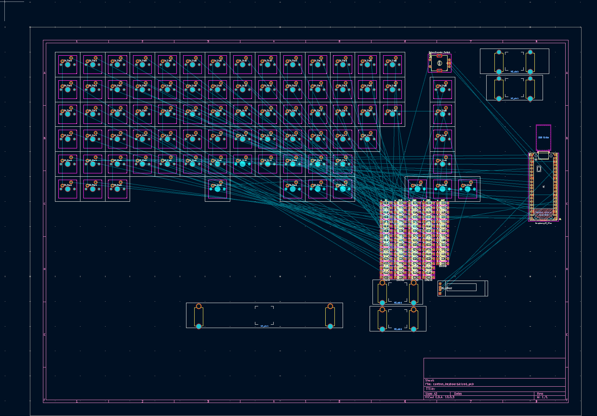
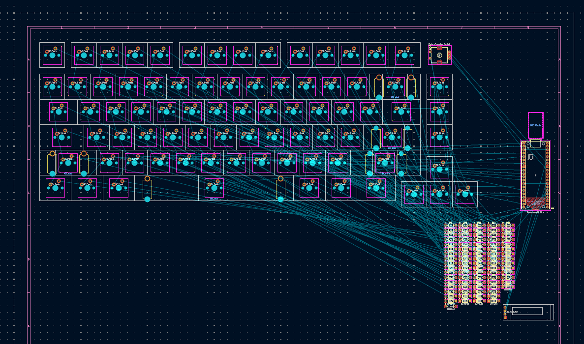
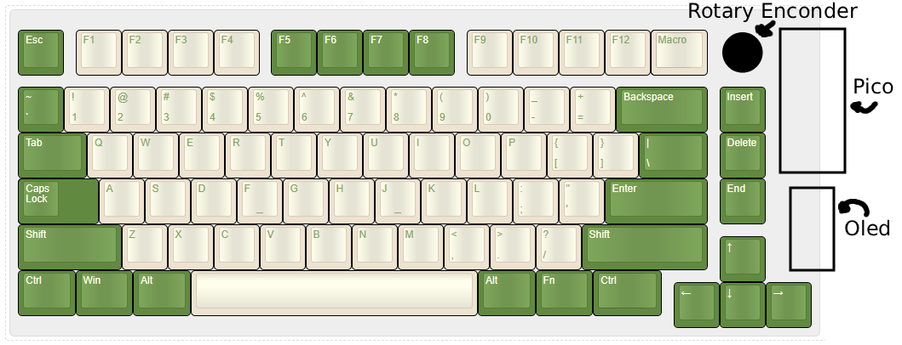
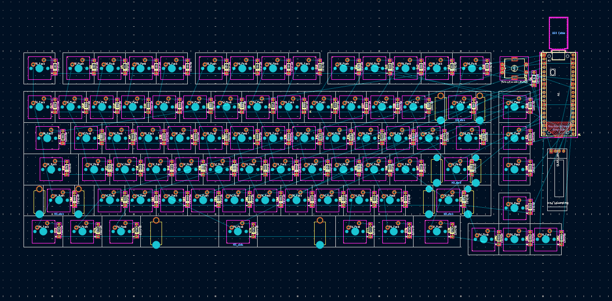
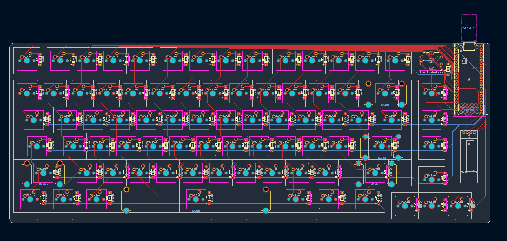
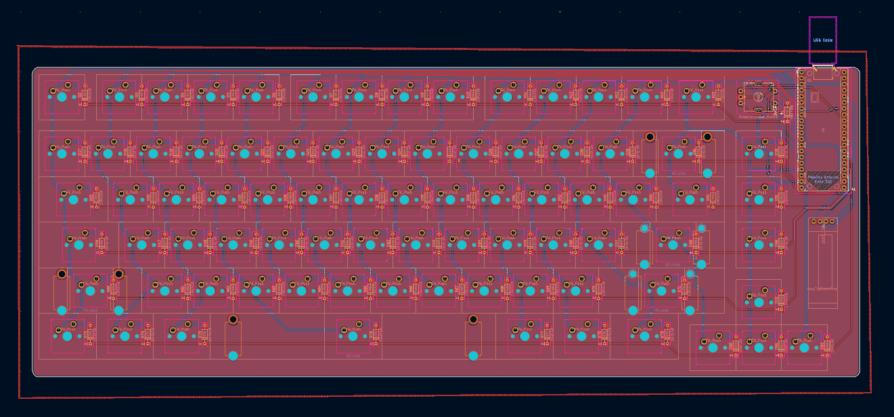
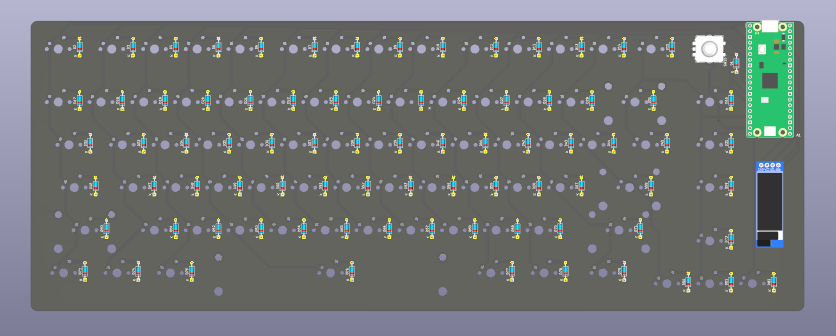
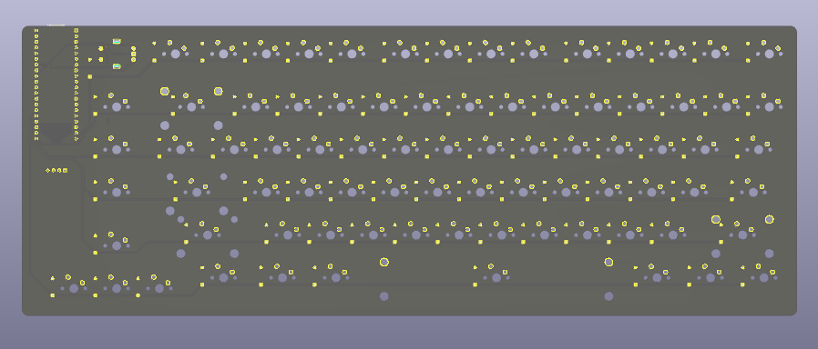

## 04/07/2026 - Making the PCB

*Time spent: 3.3 hours*

Now it's time for the fun part!
I like placing components and designing PCB's because it feels like lego and feels very satisfying when you can finally see your vision in some way or another

### Making the Rough Key Layout
I started with the rough key layout where I palced the keys roughly where I wanted them and without stabilizers or different key sizes, all 1u
I did this so that I could get an idea of what I wanted better
I spent about 0.53 hours on this

**Rough Switch Placement**

### Key placement and Stabilizers
After I finished with the rough layout I added the stabilizers and different key sizes, during this I almost made a slight change to my design
I moved the function keys over by 0.25u and made the macro key .25u bigger, changing its size from 1u to 1.25u
I made these changes so that I could center the rotary encoder with the Insert, Delete and End key.
All of this took me 1.2 hours

**Key Placement**

**Changed Layout Sketch**

### Placing the Remaining Components
After I finished with the key placing I placed the remaining components:
- Pico
- Diodes
- Screen

This process took me 0.47 hours
The most time consuming part was placing the diodes

**PCB After Components Placed**

### Wiring Traces
The final step to making my PCB is wiring the traces
I found wiring the traces pretty relaxing especially while listening to music
I also added the edge cut and rounded the edges
I made the silkscreen white and the PCB black
Aswell as those I added a filled zone to isolate the traces from the rest of the copper, it makes the trace more visible aswell
I spent 1.1 hours doing this

**PCB Without Filled Zones**

**PCB With Filled Zone**

**PCB Front View**

**PCB Back View**

