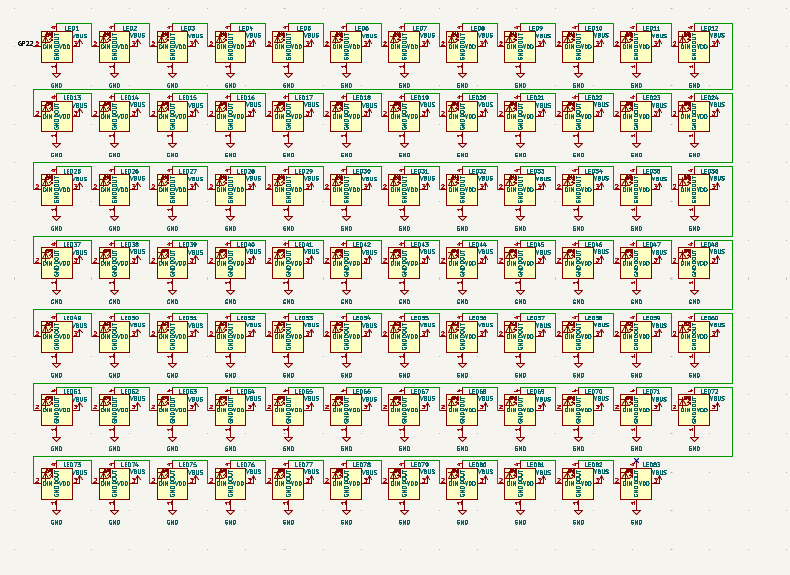
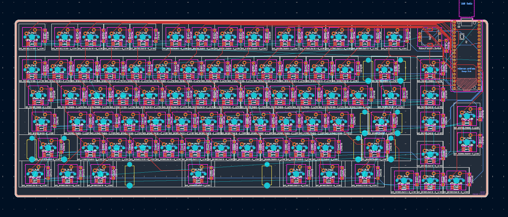
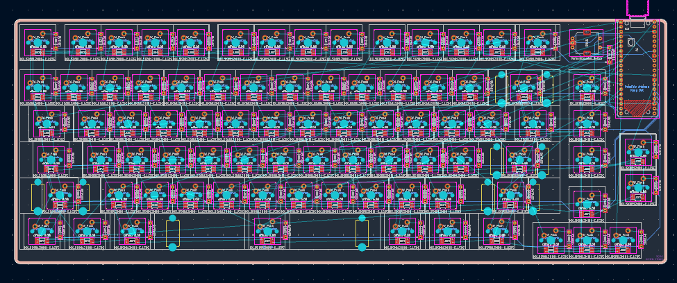
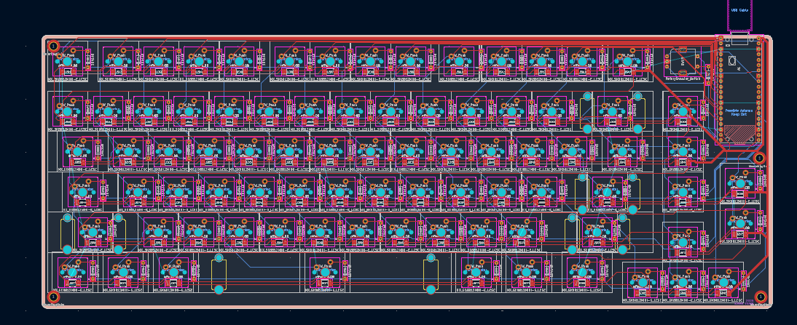

## 07/07/2026 + 08/07/2026 - Making Changes

**Time Spent: 2.7 hours**

I decided I didn't want the screen and replaced it with 2 extra macro keys
I also added SK6812MINI-E LEDS and M3 mounting holes

I started by making the changes to the schematic, I deleted the screen then added the led and wired them, I used [the data sheet](https://www.lcsc.com/datasheet/C5149201.pdf?spm=wm.sxq.inf.ggs&lcsc_vid=E1ZbBFRfEVcLVgFWFVIPAgcERQRXAVVQFVNdX1VeRlAxVlNeRFVWUFVTQllZXzsOAxUeFF5JWAoLAgZIHwANDAcKAgNABAsLWA%3D%3D) to figure out what goes where.
I struggled with keeping the schematic organized

**LED Array Schematic**

  

After I finished with the schematic I updated the PCB and started placing the LEDS aligned to the center and at the bottom of each switch, this process was very tedious and time consuming.

**LED's and Extra Macros Placed**

Once I placed the LEDS I realized I was going to need to reroute all the traces on the Front Copper Layer in order to have them wired neatly.

**Front Copper Traces Removed**

After I removed the Front Copper Layer traces I started wiring the DIN and DOUT pads of the leds, after that I wired the VDD to the VBUS of the pico.
I found wiring the Power particulary challenging as the traces have to be much bigger than the other ones so I had to make space.
I then re routed the coloumns

**Traces Routed**

