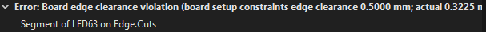
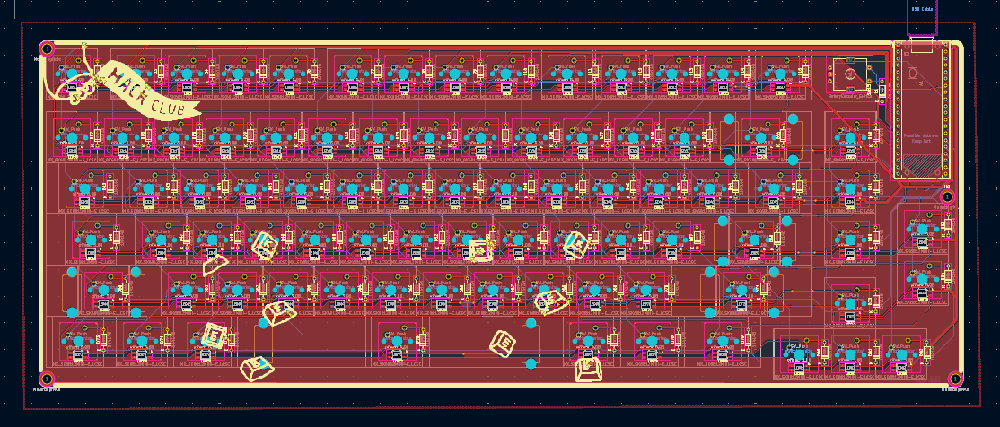
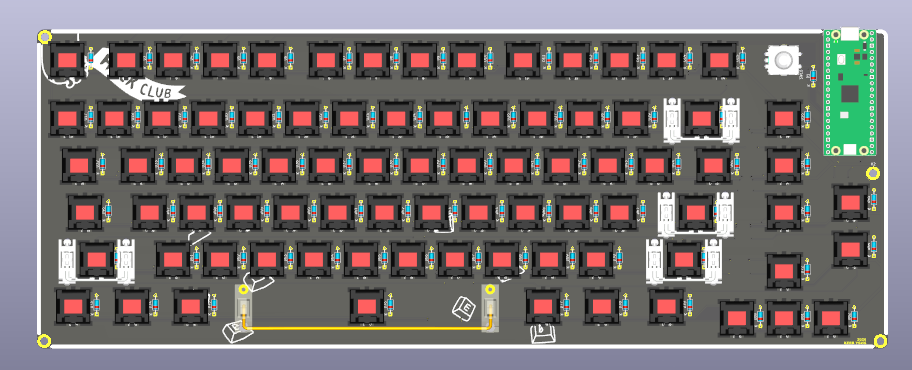

## 08/07/2026 + 09/07/2026 - Running DRC + Fixing Errors and Warnings

**Time Spent: 1.75 hours**

After I finished routing all the led's and colunms I ran the DRC
Lets just say, the results of the DRC are not what I wanted or expected, I expected some errors because i've never routed led matrix's but i though only a few, not **384** and **105** warnings 😬

**Not Good**

The most prominent error was: Board edge clearance violation

A majority of these came from the led's pads being too close to the edge cut of the led
to fix this I moved the pads slightly over and decreased the board edge clearance restraint in *File/Board Setup/Design Rules/Constraints*. The amount I changed it to is still well within the manufacture I plan to use (JLCPCB) abilities.
Although a lot of the Board Edge Clearance Violations came from the pads being to close to the edge cuts quite a few also came from the row traces being to close to the LED edge cuts, I fixed those by moving the trace up slightly.

The second large amount of errors I encountered were from the courtyards of thew switches and LED's overlapping.
I looked at the sizes of the components in the 3d viewer and data sheet and concluded that the courtyards overlapping would not be a problem so I simply ignored those errors.

I also moved the silk screen borders to avoid touching the mounting holes (had a warning for that)

I have alot of warnings still for silk screen clearance (silk screen touching other silkscreen or over an edge cut)
I believe when I export the Gerbers I can make it clip those automatically, if not I will fix them.

I also realized I forgot to wire the grounds of the LED's
I created a ground plane to wire them easily

**Finished PCB**

**Finished PCB 3D**

