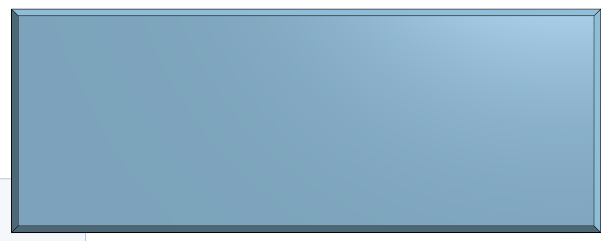
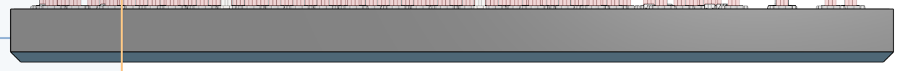
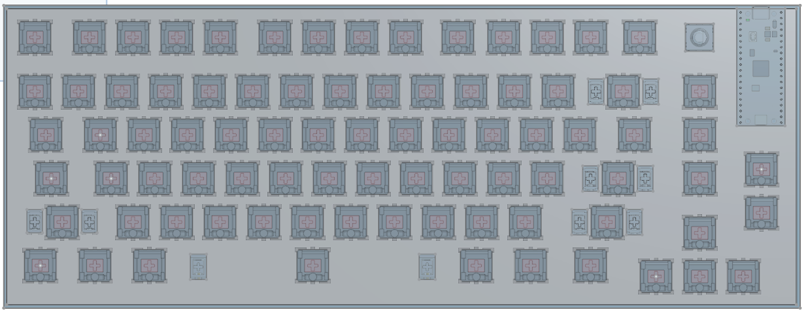
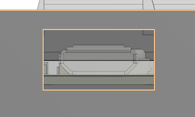
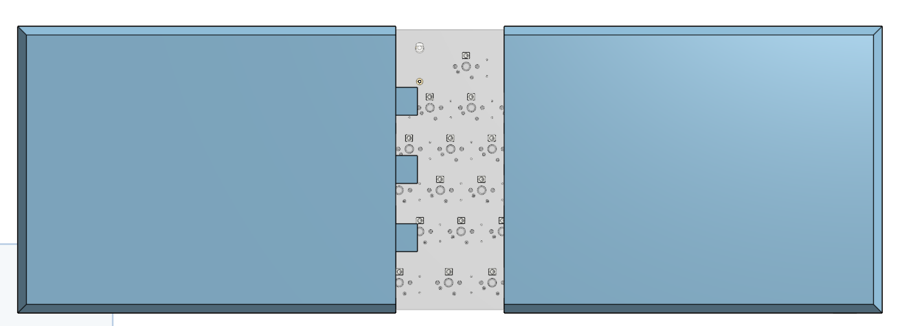

## 24/07/2026 - 08/08/2026 - Making the Case

*Time spent: 3.23 hours*

The case took me way longer than I would've wished because it was my first time using onshape and I struggled a lot doing the most basic of things. 
The progress is spread over many days doing a tiny bit of work each day.

#### What I found difficult:
- Learning how to navigate onshape
- Learning the different tools and features of onshape
- Fixing import errors
- Extruding with remove

#### What I found easy:
- Downloading the pcb model from kicad 😭

#### What I learned:
- How to make a sketch in onshape
- How to extrude in onshape (and different extruding ways)
- How to make a chamfer

### Importing the PCB 3d model and making the base
I started by importing the PCB 3d model and making the base of the case
When importing the PCB model I encountered problems with it not loading correctly

**Case Base**

### Adding walls and making the plate
I then added walls and made the plate that the keys go on.
I found it time consuming to place the key holes even with the linear pattern tool. (more screenshots of creating the plate and tools used in Images/Case)

**Case Walls**

**Case Plate**

### USB port
After I made the walls and plate I cut a hole in the wall so you can access the usb port on the raspberry pi pico.

**USB Port Cutout**

### Splitting and making alignment pillars
After all of that I split the case into 2 segments and added alignment pillars so I can connect them together easily once 3d printed

**Split and alignment**

I may make minor changes to the case after submitting
