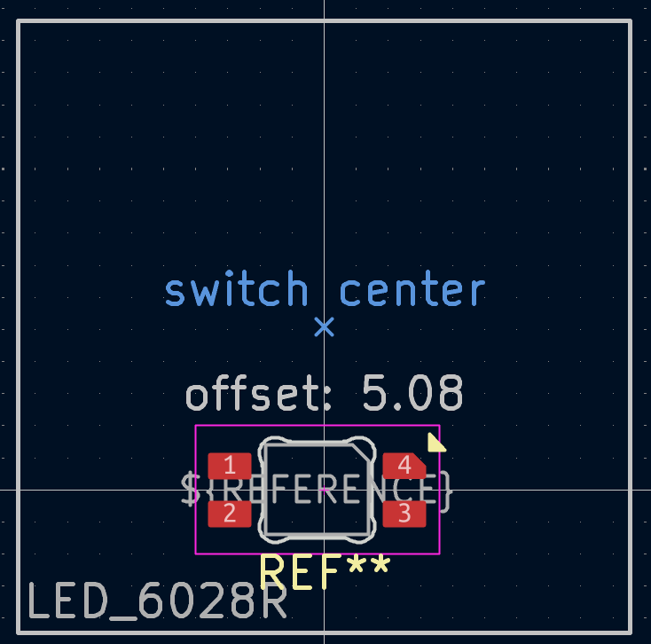
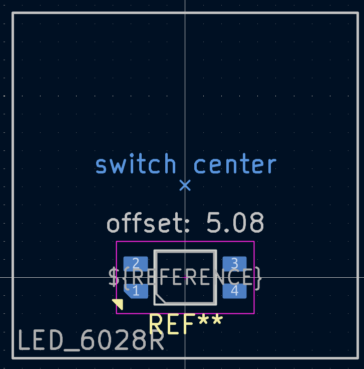
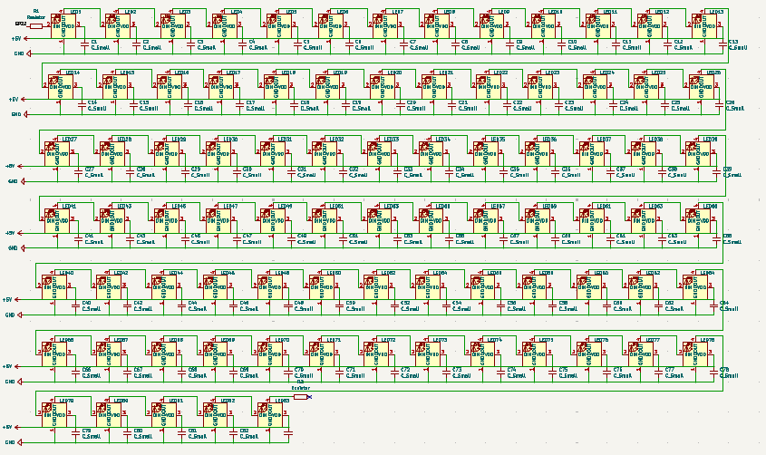
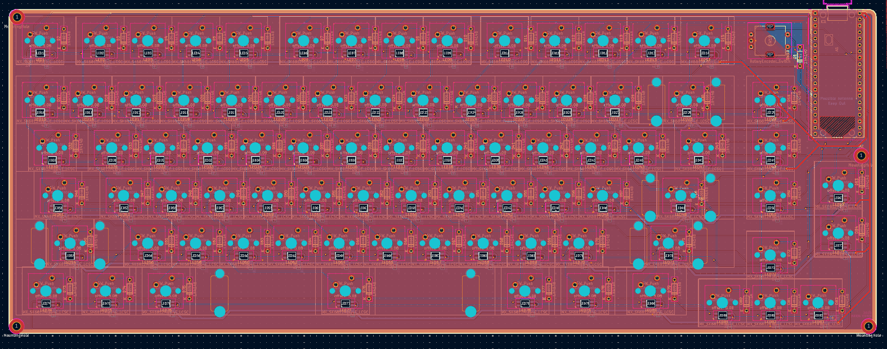

## 09/08/2026, 10/08/2026, 12/08/2026 - Fixing the PCB

**Time spent: 3.82 hours**

I started by looking at the datasheet and noticed my pin locations on the footprint where wrong and on the wrong copper layer for reverse mount (placed on bottom copper layer with hole in pcb that allows light to shine to the key)

**Old Footprint**

**Updated Footprint**

After I fixed the footprint I got started on adding the capacitors and resistors to the schematic

**Fixed LED Matrix Schematic**

After doing the schematic I moved onto the PCB, I started by removing the old LED's and traces for them and then adding the new LED's along with a capacitor for each one, I then placed the resistors at the first and last data pin of the led matrix. The next step I took was cleaning up and moving some of the column traces as they would get in the way of the LED power and data traces and it would be much easier to move those than trying to work around them with the LED traces in an already crowded area. I then wired the VBUS to one side of each capacitor and to the VDD pad of each LED as well (Decoupling capacitors). I then did the data traces. After doing all those traces I decided to add a GND plane to the back copper layer as well, not just the front. I did this because The LED's on each LED required 2 GNDS (including capacitor and GND pad) and it would be way easier to connect them that way. I already had a front copper layer so via stitching really easy.

**Fixed PCB**

