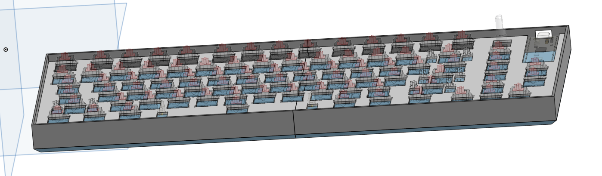

# Custom 75% Mechanical Keyboard

This is a custom 75% mechanical keyboard with 3 macro keys that I designed every part for, from the PCB to the firmware.

## Why I Built it
A while before finding out about Hack Club I wanted to make my own mechanical keyboard. After finding out how much it would cost I got de motivated and gave up on the idea.
Later I was watching YouTube when the creator mentioned Hack Club and how they help teenagers get experience in engineering. I was looking through the programs running when I saw KEEB.
With the opportunity to get the keyboard funded by Hack Club/KEEB it was the perfect chance for me to make the keyboard I had wanted to before.

## Features
- 3 Macro keys
- Rotary Encoder with a switch
- RGB back lighting
- Vast firmware support - the firmware I made uses KMK

## Designing
I started this project by brainstorming ideas for different layouts, sizes, and features. My original idea was a 75% keyboard with a screen, 1 macro key, and a rotary encoder. The idea soon evolved into what it is now.
After brainstorming I used [keyboard layout editor](https://www.keyboard-layout-editor.com/) and [photopea](https://www.photopea.com/) to design the layout and matrix wiring digitally.
I then made the first schematic and PCB in KiCad with a screen and 1 macro key. After I finished the schematic and PCB I realized I wanted to add backlighting for late night gaming/programming sessions and more macro keys, so I added sk6812 mini-e LED's under each switch and removed the screen for 2 more macro keys. After I finished with the electronics I designed a case and plate in Onshape, I found this pretty challenging as it was my first time using Onshape; I can definitely improve the case a lot. I then made the firmware, I chose to sue KMK because I have more expierence with python and have made a macropad with KMK already.

## What I Found Difficult
- LED wiring, especially because I didnt originally route with them in minde
- Modeling the case and plate in Onshape
- Sourcing cheap components with cheap shipping

## What I Learned
- Modelling in Onshape
- Better PCB design
- How mechanical keyboards work
- Reading data sheets and applying what I read
- Layers in KMK
- RGB in KMK

## BOM
| Sl No. | Name | Notes | Quantity | Price Per Unit | Cost | Shipping | Link |
| :---: | :--- | :--- | :---: | :---: | :---: | :---: | :--- |
| 1 | PCB | Manufactured by JLCPBC (minimum 5) (order through JLclone desktop app (saves money)) | 1 | — | $25.40 | $15.96 | [JLCPCB](JLCPCB) |
| 2 | Diode | Diodes to prevent ghosting (part num: 1N41481N4148-T26A) | 84 | $0.0536 | $4.50 | $5.00 | [DigiKey](https://www.digikey.ca/en/products/detail/onsemi/1N4148-T26A/978507) |
| 3 | Resistor | For start and end of LED data signals | 2 | $0.16 | $0.32 | $5.00 | [DigiKey](https://www.digikey.ca/en/products/detail/yageo/RC0805FR-07560RL/728036) |
| 4 | Capacitor | Decoupling capacitors for LED's | 83 | $0.05 | $4.15 | $5.00 | [DigiKey](https://www.digikey.ca/en/products/detail/yageo/CC0603KRX7R7BB104/302822) |
| 5 | LED | LED's for backglow of the keyboard (order in multiples of 5) | 85 | $0.089647 | $7.62 | $15.14 | [LCSC](https://www.lcsc.com/product-detail/C5149201.html?s_z=n_SK6812%2520MINI-E) |
| 6 | Raspberry Pi Pico W (with headers) | The microcontroller for the keyboard (already owned) | 1 | $0.00 | $0.00 | $0.00 | [PiShop](https://www.pishop.ca/product/raspberry-pi-pico-w/) |
| 7 | Switches | Mechanical keyboard switches (pack of 100) | 1 | $26.36 | $26.36 | $0.00 | [Amazon](https://www.amazon.com/dp/B0CX8X1X7P) |
| 8 | Keycaps | Keycaps for the switches | 1 | $14.71 | $14.71 | $0.00 | [AliExpress](https://www.aliexpress.com/item/1005009162201589.html) |
| 9 | Rotary Encoder | Rotary encoder for volume and play/pause media (already owned) | 1 | $0.00 | $0.00 | — | [DigiKey](https://www.digikey.ca/en/products/detail/bourns-inc/PEC11R-4220F-S0012/4499661) |
| 10 | Rotary Encoder Knob | Knob for the rotary encoder, 3D printed | 1 | $0.00 | $0.00 | $0.00 | — |
| 11 | Case + plate | 3D printed | 1 | $0.00 | $0.00 | $0.00 | — |
| 12 | Stabilizers | 7x 2u, 1x 6.25u | 1 | $16.88 | $16.88 | $0.00 | [Walmart](https://www.walmart.ca/en/ip/Mechanical-Keyboard-Cherry-Mx-Switch-Pcb-Mounted-Cherry-Stabilizer-Clear-Transparent-Case-6-25U-Modifier-Key-Stabiliser/7HYKUIE7RG06) |
| 13 | USB C Cable | Aviation style, coiled | 1 | $7.29 | $7.29 | $0.00 | [Amazon](https://www.amazon.ca/Coiled-Keyboards-Aviation-Mechanical-70-87inch/dp/B0GYD7GZT2) |
| 14 | Type C to Micro USB | For connecting the USB C cable to the pico | 1 | $2.49 | $2.49 | $0.00 | [Amazon](https://www.amazon.ca/dp/B0D8ZSWC1D) |

> **Additional Notes:** Items from amazon may have shipping charges, I will use prime so I did not include them in the BOM. All items from digikey have a total shipping cost of $15 CAD, I divded that by 3 to add a shipping price to all of them ($5)
* **Estimated Tax:** $18.70 CAD
* **Total:** $174.52 CAD
* **Total USD:** $125.77 USD

## Files
[PCB](PCB)
[CAD](CAD)
[Firmware](Firmware)
[Journal](JOURNAL.md)
[BOM](BOM)

## Credits
This was made possible through the funding of Hack Club and KEEB, opensource firmware and software, everyone who helped with my questions in the slack, 3D models from grabcad, tutorials on YouTube, and inspiration from other KEEB github repos.
